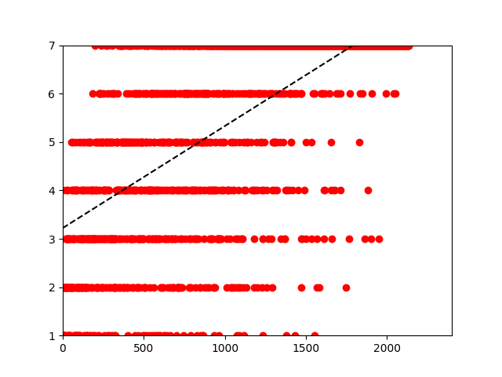
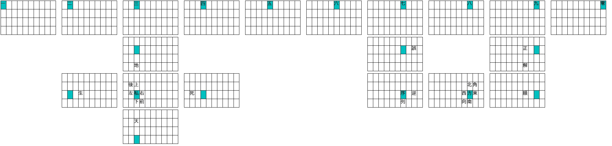

# 開発ログ


## 2023-08-19

まずは常用漢字を、学ぶ小学校と中学校の学年ごとに用意する。`scripts/kanji.json` がその結果できたものである。

Wikipedia の日本語記事データから常用漢字に限定した uni-gram (つまり頻度だけ) を取り出し頻度でソートしてみる。ソートするために、最初は dict() で保存していたのに list() 形式で JSON には出力することになった。

```
python ./scripts/populate_kanji_occurrence_from_wikipedia.py
```

(ちなみに公開している JSON ファイル ([wikipedia_joyo_kanji_freq.json](https://github.com/kirameister/aki_code/blob/development/data/wikipedia_joyo_kanji_freq.json)) はその後手動で整形したものである)

その頻度データと、学ぶ漢字の学年 (中学校はまとめて 7 としてカウント) を並べてみる。Linear regression にしてみる。

```
python ./scripts/linear_regression_betweeen_occur_and_year.py
r^2 score: 0.45773262009027904
```

そしてプロットした図がこちらである。



率直に言うと、「思ったほど correlate してないな」と感じた。もう少し綺麗にまとまっていれば (そこまで分散していなければ) 遠慮なく小学校の低学年で学ぶ漢字を優先して配列に追加できるのにな、ということなのだが、そう簡単な話でもない、ということなのだろう。もう少しどうするか考える。

## 2023-08-20

Wikipedia からのデータも bi-gram 以上の n-gram として抽出しておく。例によって list() としてソートしておく (公開しているファイルは整形済み…と思ったらそのままで 200MB 以上のデータになっていたので (データ件数だけだと 10M いかないぐらい)、1M で cut-off しておく - それでも多すぎるという可能性は大いにあるけれど - [n_gram_to_weight.json](https://github.com/kirameister/aki_code/blob/development/data/n_gram_to_weight.json))。

```
python ./scripts/n_gram_generator.py
head ./data/n_gram_to_weight.json
[
    [
        "日本",
        594779
    ],
    [
        "現在",
        246779
    ],
    [
```

…データを眺めていると、やはりというか、最初は bi-gram ばかり出てくる。しかしこれ、実装方法がなにか間違っている気がしてきた (主に 4-gram 以上のトークンの扱いについて)。それに人間の脳にはそこまで容量があるわけでもないので、高々 (文脈を知るための) tri-gram で十分なのでは、という気がしてきた。後日 script を変更して試してみよう。

…さっさと変更してしまえ、ということで変更してみた。今度は cut-off も 10k という大胆さ(?)。またにらめっこすることにする。

## 2023-08-21

大岡俊彦さんのブログでいくつかやり取りが発生する。

* http://oookaworks.seesaa.net/article/500397294.html
* http://oookaworks.seesaa.net/article/500430534.html
* http://oookaworks.seesaa.net/article/500430829.html
* http://oookaworks.seesaa.net/article/500430949.html
* http://oookaworks.seesaa.net/article/500433316.html

AKI-code は最初から目指している方向が違うので、全てのポイントがそのまま当てはまるわけではないのだが、やっぱり覚えられない/覚えにくいというのはクリティカルと言うのは間違いなさそう (覚えていない=存在しないストローク)。

そういう観点から熟語ベースで配列を考えていく、という考えに至った。極論すると、あまり使われないような漢字でも、覚えやすければ採用する方が良いだろうという感じ (勿論限度はあるが…)。運指については「記憶のしやすさと比較すると重要度はだいぶ落ちる」という認識。そのことを考えながら、もう少し具体的に掘り下げていくと…

1. 数字あたりを一つの出発点とする (これ自体は覚えるのが簡単)
2. 「左右」や「上下」といった比較的わかりやすい反義語 (特に方向が絡むもの) も一つの出発点として使える

とか考えた。

数字についてだが、/11/ → '一' といった配列を今考えている。これは以下のような理由から:

* 一、二、三を除くと top 10% 以下の出現頻度ランキング
* しかし数値が含まれる熟語はそこそこある (かも? 要確認)

```
$ cat -n ./wikipedia_joyo_kanji_freq.json | grep -E '[一二三四五六七八九零〇十百千万億兆]'
    13	{"一": [1328052,"1"]},
   147	{"三": [374838,"1"]},
   197	{"二": [305472,"1"]},
   314	{"万": [206767,"2"]},
   465	{"十": [134809,"1"]},
   522	{"四": [115231,"1"]},
   556	{"千": [103823,"1"]},
   595	{"五": [94833,"1"]},
   627	{"八": [88326,"1"]},
   748	{"九": [68232,"1"]},
   863	{"百": [52344,"1"]},
   869	{"六": [51528,"1"]},
   924	{"億": [45416,"4"]},
   964	{"七": [41194,"1"]},
  1659	{"兆": [8693,"4"]},
  1759	{"零": [6542,"7"]},
$ cat -n ./n_gram_to_weight.json | grep -E '[一二三四五六七八九零〇十百千万億兆]' | head
    22	["一部",124532],
    33	["一般",108735],
    42	["一方",100930],
    87	["第二",65670],
   103	["第一",59553],
   188	["一人",44697],
   224	["第二次",40669],
   250	["一般的",38367],
   277	["一時",35723],
   341	["二次世",30646],
```

次に「反義語」だが、今の段階では

* /a;/ → 右
* /;a/ → 左

というのを考えている。

ところで、これらの配列表 (ストローク表?) ってどういう representation が良いだろうね? 機械が読むことを前提に JSON で記述するというのは安直だけど、それだと全体を把握するのは面倒かも。Validation のようなものを用意すれば良い話かも?


## 2023-08-24

どのようにして計算機を使って配列の構築 (開発、と言っても良いのか?) するか考えてみた。全てを完全自動化することはできない/したくないと考えているのだが、こういう方法ならあり得るかも知れないと思った。

* 何らかの形で熟語と漢字にスコアを与える (normalize)
* すでに配列上にある漢字に、(熟語として) 組み合わせることのできる漢字をランク付け
    * 例: `候補の漢字スコア = alpha * sum(熟語スコア) + その漢字のスコア` (ただし熟語スコアは候補の漢字が現れるときに限る)

日本語の式だとわかりにくいね。コード書いてみるか。

…というわけで書いてみた。`_normalized.json` というファイルがそれである。`log10()` を使っているが、わざわざ log の底を 10 にしたのに大きな理由はない。強いて言えば、個々の漢字の出現数よりも、様々な熟語でその漢字が使われている方がスコアをより高くしたかったからだろう (それならばもう少し cut-off を控えめにしたほうが良いかも。これはまた調整するかも)。

あれからもう少し考えて、以下の漢字を (新たに) 追加しようと考えた (簡単に覚えられるだろうというのがその理由):

* 数字の一から九 (既出)
* 右, 左 (既出)
* 東西南北
* 上下

これらの内容を `data/stroke_layout.json` に記述してみた。これをベースに関連する熟語をランク付けするのだが、`alpha=0.5` の場合、こういう感じになる:

```
python ./scripts/suggest_next_kanji_candidate_dfs.py | head -n 5
('大', 31.685197700258666)
('部', 27.229915332465453)
('第', 23.37900931251443)
('方', 23.340216787662317)
('年', 20.277657810429055)
```

ふーむ。これだけ見てもよく分からない。どういう (既に定義された) 漢字から導出されたのか知りたいので、今度はその辺を出力するスクリプトを書いてみよう (ついでに alpha の値も argparse で読めるようにしておけ、という話もある)。

…恥ずかしいことに式が間違っていたということに今更気がつく。後で更新します。


## 2023/08/24

計算式間違っていたという大分恥ずかしいことをしてしまったのだけれど、一旦スクリプトの名前と生成ファイル名を整理してみることにする。

* 数字の prefix をスクリプト名に入れる -- 昔やったことのある簡単ハックなのだけれど、案外役に立つ。
* `freq` を `occurr` に変更 (`occurr` は `occurrence` の略; `occur` だと動詞と混合しそうでやめた) -- これは freq という表現が単純に気持ち悪かったから。

計算式については、一旦個々の wikipedia n-gram の重みを全て忘れて、単純に occurrence の数だけで勝負したらどうなるのか興味を持ってみた。これは「高いスコアが n-gram から得られたから」よりも「覚えやすいストローク」を求めるべきで、そのための候補は多いほうが良いだろうと考えたため。N-gram の生成 cut-off も 10k から 100k にして走らせてみる。

単純に n-gram のスコアを無視して、全ての重みを 1 として出力してみると、なかなか面白い (というかより使えそうな情報が出てきた)。

```
python ./scripts/4.suggest_next_kanji_candidate_dfs.py | head
('十', 56.0)
('大', 33.0)
('部', 28.0)
('方', 25.0)
('国', 24.0)
('年', 23.0)
('中', 22.0)
('郎', 22.0)
('州', 21.0)
('新', 21.0)
..
```

単なる数値では味気ない (というはそこから元データに grep かけるのが面倒な) ので、実際にマッチした n-gram を出力するほうが良いかも知れない。

…というわけで更新してみた:

```
python ./scripts/4.suggest_next_kanji_candidate_dfs.py | head -n 3
('十', ['十二', '十二', '五十', '三十', '二十', '十三', '十六', '十一', '八十', '四十', '九十九', '三十三', '九十', '十八', '十五', '二十四', '三十六', '八十八', '十四', '五十六', '十七', '七十', '二十一', '二十五', '六十', '二十二', '二十八', '東十', '三十一', '西十', '四十八', '二十三', '二十六', '三十五', '四十七', '五十三', '二十七', '三十七', '三十二', '十九', '四十九', '二十九', '三十四', '三十八', '七十七', '四十二', '四十四', '六十四', '南十', '六十六', '四十一', '五十一', '五十二', '五十四', '六十九', '三十九', '八十二'])
('大', ['大西', '大西', '東大', '大東', '一大', '東北大', '北大', '三大', '五大', '二大', '四大', '西大', '南大', '北大西', '右大', '左大', '八大', '上大', '大北', '大下', '六大', '大一', '大八', '大三', '七大', '西六大', '下大', '南大西', '九大', '南大東', '大五', '三大大', '大南', '西大西'])
('部', ['一部', '一部', '南部', '北部', '西部', '東部', '下部', '上部', '部下', '北西部', '北東部', '南西部', '南東部', '三部', '東北部', '二部', '東南部', '西南部', '西北部', '北部九', '四部', '一部上', '五部', '六部', '部左右', '一部部', '部上', '部一', '南部一'])
...
```

…なんだかこれはグラフ問題なのではないかと薄々考えているのだが、既にストローク表にある漢字が tri-gram にある場合、そこをブーストするような仕組みとかあっても良いかも (またはそれ用のオプションをつけるとか)。

…というわけでそういうオプションを付けてみた:

```
python ./scripts/4.suggest_next_kanji_candidate_dfs.py --mesh_mode | head
('十', ['九十九', '九十九', '三十三', '二十四', '三十六', '八十八', '五十六', '二十一', '二十五', '二十二', '二十八', '三十一', '四十八', '二十三', '二十六', '三十五', '四十七', '五十三', '二十七', '三十七', '三十二', '四十九', '二十九', '三十四', '三十八', '七十七', '四十二', '四十四', '六十四', '六十六', '四十一', '五十一', '五十二', '五十四', '六十九', '三十九', '八十二'])
('部', ['北西部', '北西部', '北東部', '南西部', '南東部', '東北部', '東南部', '西南部', '西北部', '北部九', '一部上', '部左右', '一部部', '南部一'])
('郎', ['三四郎', '三四郎', '八五郎', '四郎左', '三郎左', '八郎左', '三五郎', '五郎左', '五郎右', '郎三郎', '三郎右', '東一郎', '八郎右', '九郎右'])
('州', ['北九州', '北九州', '南九州', '九州北', '州南西', '州南東', '九州南', '州北西', '州北東', '東九州', '西九州', '九州西'])
('方', ['南西方', '南西方', '南東方', '東西方', '南北方', '北西方', '北東方', '左右方', '東北方', '上下方', '上四方', '東南方'])
('京', ['東京六', '東京六', '西東京', '北京五', '東京五', '東京三', '東京一', '一東京', '二東京', '東京上', '東東京', '東京下'])
('式', ['九七式', '九七式', '九九式', '九六式', '九四式', '八九式', '九五式', '九二式', '三八式', '九三式', '九八式', '九一式'])
('国', ['国東北', '国東北', '四国八', '一国一', '国北東', '西国三', '国南西', '国三国', '国南東', '国四国', '一国二', '国北西'])
('位', ['五位下', '五位下', '四位下', '五位上', '四位上', '三位一', '六位上', '下上位', '六位下'])
('衛', ['五右衛', '五右衛', '三右衛', '八右衛', '三左衛', '五左衛', '六右衛', '六左衛', '七左衛'])
```

なるほど、なかなか面白い。'郎' はおそらく名前から多く取り出されていそうだし、'州' は '九州' から得られたものが殆どという印象を受ける。

## 2023-08-25

以下の記事を読んだ:

* http://oookaworks.seesaa.net/article/500496692.html

同音異義語というのは確かに大きなテーマ、というか AKI-code 始めようと思った主な理由なのだけれど、改めて調べてみると結構ある:

* https://yattoke.com/2018/05/11/homonym/
* https://dank.jp/blog/homonym/

あるべき姿としては、よくある同音異義語や confusing な単語/言い回しに含まれる漢字を取り出して、ストロークの中に入れるということになるのだろうけれど、中には「遺骸」とか「歓心」といった普段使わないような表現もある (少なくとも日常生活で「遺骸」なんて言葉書いた記憶ないぞ)。この辺は結構底なし沼というか、多分どんなに頑張っても (最大でも 40 x 40 = 1600 という制約で) 抜け落ちる漢字は出てくるのだろうなと想像する。

…そこで考えたのが、AKI-code としてはいくつかの「レベル分け」をするというもの。

1. core: `/1/` から `/0/` までのダブルストローク + `/[uiojklm,.]{,2}/` + `/[wersdfxcv]{,2}/` = 10 + 9^2 * 2 = 172
2. core-ext: `/1/` から `/0/` までのダブルストローク + `/[uiojklm,.wersdfxcv]{,2}/` = 10 + 18^2 = 334
3. (名前未定 -- ext??): それ以上

最低限:
* 覚えやすい
* 同音異義語に出てくる漢字をできるだけカバーする

ような漢字を優先的に core から配置して、ある意味それ以外はユーザー任せにしてしまうとか? しかしそれはそれで無責任な気も大いにする。とりあえず SKK dictionary の同音異義語を眺めてみようか。

https://github.com/skk-dev/dict/blob/master/SKK-JISYO.S

## 2023-08-26

同音異義語関係をもう少し調べてみた。といっても SKK の辞書を眺めてみただけなのですが。 https://github.com/skk-dev/dict/tree/master にある `SKK-JISYO.S` を

```
cat SKK-JISYO.S | nkf -w | grep -E '\/.*\/.*\/' | grep -P '[\p{Han}][\p{Han}]' | head
あさひ /朝日/旭/
いがい /以外/意外/
いこう /以降/移行/意向/
いし /石/医師/
いじょう /以上/異常/
いち /一/位置/壱/市/
いちじ /一時/一次/
いと /糸/意図/
いらい /以来/依頼/
かい /会/回/解/開/改/界/海/階/快/介/壊/械/貝/戒/皆/絵/悔/怪/懐/街/塊/灰/甲斐/恢/廻/魁/芥/蟹/晦/拐/
```

とかやってみる。なかなか使える情報かも知れない。これをベースに、同音異義語に使われる漢字を優先的にストロークに取り入れていくとか良いかも知れない。

…というわけで SKK の辞書を使った同音異義語で使われている常用漢字のソートして表示するスクリプトを書いてみた。こんな感じ:

```
cat ../skk-dict/SKK-JISYO.ML | nkf -w | python ./scripts/5.identify_homophonic_kanjis_from_skk_dict.py | head -n 3
('大', ['偉大-いだい', '医大-いだい', '遠大-えんだい', '大井-おおい', '大炊-おおい', '大分-おおいた', '大板-おおいた', '大江-おおえ', '大兄-おおえ', '大神-おおかみ', '大貝-おおがい', '大型-おおがた', '大潟-おおがた', '大形-おおがた', '大金-おおがね', '大鐘-おおがね', '大久保-おおくぼ', '大窪-おおくぼ', '大熊-おおくま', '大隈-おおくま', '大倉-おおくら', '大蔵-おおくら', '大阪-おおさか', '大坂-おおさか', '大潮-おおしお', '大塩-おおしお', '大路-おおじ', '大田-おおた', '大塚-おおつか', '大束-おおつか', '大槻-おおつき', '大月-おおつき', '大友-おおとも', '大伴-おおとも', '大庭-おおば', '大葉-おおば', '大羽-おおば', '大場-おおば', '大判-おおばん', '大番-おおばん', '大旨-おおむね', '大森-おおもり', '大盛り-おおもり', '大矢-おおや', '大谷-おおや', '大家-おおや', '大屋-おおや', '大宅-おおや', '大宅-おおやけ', '御大-おんたい', '過大-かだい', '強大-きょうだい', '広大-こうだい', '誇大-こだい', '最大-さいだい', '細大-さいだい', '三大-さんだい', '散大-さんだい', '私大-しだい', '四大-しだい', '掌大-しょうだい', '事大-じだい', '重大-じゅうだい', '甚大-じんだい', '盛大-せいだい', '正大-せいだい', '絶大-ぜつだい', '壮大-そうだい', '大安-たいあん', '大意-たいい', '大尉-たいい', '大家-たいか', '大過-たいか', '大化-たいか', '大火-たいか', '大廈-たいか', '大会-たいかい', '大海-たいかい', '大患-たいかん', '大観-たいかん', '大官-たいかん', '大河-たいが', '大概-たいがい', '大願-たいがん', '大気-たいき', '大器-たいき', '大挙-たいきょ', '大局-たいきょく', '大曲-たいきょく', '大金-たいきん', '大義-たいぎ', '大儀-たいぎ', '大業-たいぎょう', '大群-たいぐん', '大軍-たいぐん', '大慶-たいけい', '大系-たいけい', '大兄-たいけい', '大計-たいけい', '大圏-たいけん', '大権-たいけん', '大剣-たいけん', '大言-たいげん', '大呼-たいこ', '大綱-たいこう', '大功-たいこう', '大江-たいこう', '大行-たいこう', '大差-たいさ', '大佐-たいさ', '大祭-たいさい', '大才-たいさい', '大作-たいさく', '大罪-たいざい', '大山-たいざん', '大使-たいし', '大志-たいし', '大史-たいし', '大赦-たいしゃ', '大社-たいしゃ', '大酒-たいしゅ', '大衆-たいしゅう', '大暑-たいしょ', '大書-たいしょ', '大所-たいしょ', '大将-たいしょう', '大賞-たいしょう', '大正-たいしょう', '大勝-たいしょう', '大笑-たいしょう', '大捷-たいしょう', '大詔-たいしょう', '大食-たいしょく', '大身-たいしん', '大震-たいしん', '大人-たいじん', '大水-たいすい', '大酔-たいすい', '大数-たいすう', '大勢-たいせい', '大成-たいせい', '大政-たいせい', '大声-たいせい', '大聖-たいせい', '大切-たいせつ', '大雪-たいせつ', '大戦-たいせん', '大全-たいぜん', '大層-たいそう', '大喪-たいそう', '大葬-たいそう', '大宗-たいそう', '大息-たいそく', '大抵-たいてい', '大敵-たいてき', '大典-たいてん', '大度-たいど', '大任-たいにん', '大敗-たいはい', '大半-たいはん', '大藩-たいはん', '大夫-たいふ', '大輔-たいふ', '大兵-たいへい', '大変-たいへん', '大砲-たいほう', '大鵬-たいほう', '大宝-たいほう', '大望-たいぼう', '大麻-たいま', '大枚-たいまい', '大命-たいめい', '大役-たいやく', '大厄-たいやく', '大約-たいやく', '大要-たいよう', '大洋-たいよう', '大乱-たいらん', '大量-たいりょう', '大漁-たいりょう', '大猟-たいりょう', '大輪-たいりん', '大刀-たち', '大輔-たゆう', '大夫-たゆう', '短大-たんだい', '大王-だいおう', '大黄-だいおう', '大寒-だいかん', '大工-だいく', '大慶-だいけい', '大悟-だいご', '大罪-だいざい', '大師-だいし', '大姉-だいし', '大志-だいし', '大小-だいしょう', '大将-だいしょう', '大事-だいじ', '大治-だいじ', '大字-だいじ', '大寺-だいじ', '大慈-だいじ', '大嘗-だいじょう', '大乗-だいじょう', '大判官-だいじょう', '大臣-だいじん', '大尽-だいじん', '大神-だいじん', '大体-だいたい', '大腿-だいたい', '大隊-だいたい', '大々-だいだい', '大地-だいち', '大腸-だいちょう', '大篆-だいてん', '大典-だいてん', '大東-だいとう', '大刀-だいとう', '大塔-だいとう', '大同-だいどう', '大道-だいどう', '大弐-だいに', '大人-だいにん', '大脳-だいのう', '大分-だいぶ', '大夫-だいぶ', '大仏-だいぶつ', '大便-だいべん', '大物-だいもつ', '大門-だいもん', '大紋-だいもん', '大理-だいり', '大領-だいりょう', '大宰府-だざいふ', '長大-ちょうだい', '帝大-ていだい', '大蒜-にんにく', '肥大-ひだい', '膨大-ぼうだい', '厖大-ぼうだい', '大和絵-やまとえ'])
('一', ['一意-いちい', '一位-いちい', '一員-いちいん', '一因-いちいん', '一院-いちいん', '一方流-いちかたりゅう', '一眼-いちがん', '一丸-いちがん', '一群-いちぐん', '一軍-いちぐん', '一言-いちげん', '一見-いちげん', '一元-いちげん', '一期-いちご', '一時-いちじ', '一次-いちじ', '一事-いちじ', '一字-いちじ', '一巡-いちじゅん', '一順-いちじゅん', '一旬-いちじゅん', '一助-いちじょ', '一女-いちじょ', '一条-いちじょう', '一場-いちじょう', '一段-いちだん', '一団-いちだん', '一同-いちどう', '一堂-いちどう', '一道-いちどう', '一任-いちにん', '一人-いちにん', '一年-いちねん', '一念-いちねん', '一宮-いちのみや', '一の宮-いちのみや', '一部-いちぶ', '一分-いちぶ', '一瞥-いちべつ', '一別-いちべつ', '一抹-いちまつ', '一名-いちめい', '一命-いちめい', '一物-いちもつ', '一門-いちもん', '一文-いちもん', '一躍-いちやく', '一役-いちやく', '一様-いちよう', '一葉-いちよう', '一理-いちり', '一里-いちり', '一利-いちり', '一律-いちりつ', '一塁-いちるい', '一類-いちるい', '一礼-いちれい', '一例-いちれい', '一家-いっか', '一過-いっか', '一価-いっか', '一回-いっかい', '一階-いっかい', '一介-いっかい', '一塊-いっかい', '一角-いっかく', '一画-いっかく', '一括-いっかつ', '一喝-いっかつ', '一貫-いっかん', '一環-いっかん', '一巻-いっかん', '一気-いっき', '一揆-いっき', '一騎-いっき', '一級-いっきゅう', '一休-いっきゅう', '一興-いっきょう', '一驚-いっきょう', '一曲-いっきょく', '一局-いっきょく', '一計-いっけい', '一景-いっけい', '一系-いっけい', '一決-いっけつ', '一穴-いっけつ', '一見-いっけん', '一件-いっけん', '一軒-いっけん', '一間-いっけん', '一個-いっこ', '一顧-いっこ', '一戸-いっこ', '一己-いっこ', '一行-いっこう', '一向-いっこう', '一考-いっこう', '一刻-いっこく', '一国-いっこく', '一切-いっさい', '一再-いっさい', '一昨-いっさく', '一策-いっさく', '一矢-いっし', '一子-いっし', '一指-いっし', '一死-いっし', '一糸-いっし', '一式-いっしき', '一色-いっしき', '一室-いっしつ', '一失-いっしつ', '一周-いっしゅう', '一蹴-いっしゅう', '一週-いっしゅう', '一周忌-いっしゅうき', '一周期-いっしゅうき', '一緒-いっしょ', '一所-いっしょ', '一書-いっしょ', '一生-いっしょう', '一升-いっしょう', '一笑-いっしょう', '一将-いっしょう', '一新-いっしん', '一心-いっしん', '一身-いっしん', '一審-いっしん', '一睡-いっすい', ...])
('人', ['海人-あま', '異人-いじん', '偉人-いじん', '一人-いちにん', '猿人-えんじん', '厭人-えんじん', '怪人-かいじん', '家人-かじん', '歌人-かじん', '佳人-かじん', '寡人-かじん', '閑人-かんじん', '漢人-かんじん', '韓人-かんじん', '官人-かんにん', '外人-がいじん', '画人-がじん', '雅人-がじん', '奇人-きじん', '貴人-きじん', '畸人-きじん', '貴人-きにん', '貴夫人-きふじん', '貴婦人-きふじん', '求人-きゅうじん', '旧人-きゅうじん', '狂人-きょうじん', '擬人-ぎじん', '義人-ぎじん', '軍人-ぐんじん', '県人-けんじん', '賢人-けんじん', '下人-げにん', '工人-こうじん', '公人-こうじん', '行人-こうじん', '後人-こうじん', '黒人-こくじん', '国人-こくじん', '個々人-ここじん', '個個人-ここじん', '個人-こじん', '故人-こじん', '古人-こじん', '吾人-ごじん', '五人-ごにん', '才人-さいじん', '殺人-さつじん', '罪人-ざいにん', '詩人-しじん', '私人-しじん', '士人-しじん', '死人-しにん', '囚人-しゅうじん', '衆人-しゅうじん', '小人-しょうじん', '証人-しょうにん', '商人-しょうにん', '小人-しょうにん', '上人-しょうにん', '聖人-しょうにん', '諸人-しょにん', '新人-しんじん', '時人-じじん', '住人-じゅうにん', '十人-じゅうにん', '常人-じょうじん', '情人-じょうじん', '人為-じんい', '人意-じんい', '人煙-じんえん', '人界-じんかい', '人外-じんがい', '人権-じんけん', '人件-じんけん', '人絹-じんけん', '人工-じんこう', '人口-じんこう', '人皇-じんこう', '人工受精-じんこうじゅせい', '人工授精-じんこうじゅせい', '人後-じんご', '人語-じんご', '人身-じんしん', '人心-じんしん', '人臣-じんしん', '人事-じんじ', '人生-じんせい', '人世-じんせい', '人選-じんせん', '人造-じんぞう', '人体-じんたい', '人知-じんち', '人智-じんち', '人頭-じんとう', '人徳-じんとく', '人道-じんどう', '人馬-じんば', '人望-じんぼう', '人名-じんめい', '人命-じんめい', '人籟-じんらい', '人力-じんりょく', '粋人-すいじん', '成人-せいじん', '聖人-せいじん', '世人-せじん', '先人-せんじん', '仙人-せんにん', '千人-せんにん', '前人-ぜんじん', '全人-ぜんじん', '善人-ぜんにん', '俗人-ぞくじん', '属人-ぞくじん', '対人-たいじん', '大人-たいじん', '代人-だいにん', '大人-だいにん', '知人-ちじん', '痴人-ちじん', '超人-ちょうじん', '鳥人-ちょうじん', '釣人-ちょうじん', '鉄人-てつじん', '哲人-てつじん', '天人-てんじん', '天人-てんにん', '陶人-とうじん', '唐人-とうじん', ...])
```

これ、抽出する (読みに対する) 漢字は 2 文字以上でないと駄目とか制約を付けたのだけれど、取っ掛かりの一つとしては良いかも知れない。問題を挙げるとすれば、表示されている漢字が、同音異義語を disambiguate する感じになるかどうかはこの出力からはわからないということなのだけれど、もう少しスクリプトを改良したら、そのへんスマートにやってくれるようにできるかも知れない。

…というわけで上記のスクリプトを改良して、同音異義語を disambiguate する漢字 (つまり同音異義語の漢字リストの中に一つしか存在しない漢字) を出力するようにしてみた。今度は個々の漢字の読みと表記だけではあまり意味がないので、該当する全ての漢字を出力するようにした (つまり該当漢字ごとの出力がかなり多くなる)。以下のようにして見ることができる:

```
cat ../skk-dict/SKK-JISYO.ML | nkf -w | python ./scripts/6.identify_homophonic_disambiguating_kanji_from_skk_dict.py
('生', ['おいたt /生い立/追い立/', 'うみだs /生み出/産み出/', 'いきかえr /生き返/行き帰/', 'あそう /麻生/阿僧/', 'いき /息/域/意気/粋/閾/遺棄/壱岐/委棄/行き/生き/位記/', 'いきかた /生き方/行き方/', 'いきがい /域外/生き甲斐/', 'いきち /閾値/生き血/', 'いくた /生田/幾多/', 'いっしょう /一生/一升/一笑/一将/', 'いのう /稲生/伊能/異能/', 'いんせい /院生/陰性/院政/隠棲/', 'おいさき /生い先/老い先/', 'おうじょう /往生/王城/', 'かいせい /快晴/改正/回生/開成/改姓/', 'がくせい /学生/学制/楽聖/', 'きじ /記事/生地/木地/雉/棄児/', 'きず /傷/瑕/疵/生酢/', 'きせい /規制/帰省/既成/寄生/奇声/既製/気勢/規正/棋聖/祈誓/期成/', 'きっすい /生粋/喫水/吃水/', 'きりゅう /桐生/気流/寄留/', 'ぐんせい /群生/軍政/軍制/', 'けしょう /化粧/化生/', 'げんせい /厳正/現世/現勢/原生/', 'こせい /個性/古生/', 'こんじょう /根性/今生/懇情/紺青/', 'こんせい /混成/混声/懇請/混生/', 'ごせい /悟性/語勢/互生/碁聖/', 'さんせい /賛成/参政/酸性/三世/三精/産生/山西/三省/三聖/', 'ししょう /支障/師匠/刺傷/死傷/視床/四生/私娼/指掌/師承/', 'しゃせい /射精/写生/', 'しゅうせい /修正/習性/修整/集成/終世/終生/秋声/', 'しゅじょう /衆生/主上/主情/', 'しゅっせい /出生/出征/出精/', 'しょうが /生姜/小我/', 'しょうこく /小国/生国/', 'しょうじゃ /精舎/盛者/生者/', 'しょうせい /小生/招請/小成/焼成/勝勢/', 'しょうとく /承徳/称徳/正徳/生得/', 'しょうねん /少年/正念/生年/', 'しょうめつ /消滅/生滅/', 'しょうやく /抄訳/生薬/硝薬/', 'しょうらい /将来/生来/招来/', 'しょくせい /職制/植生/食性/', 'しんせい /申請/新星/真性/神聖/新生/新制/真正/新製/神性/新政/心性/親政/', 'じせい /時制/自制/時世/磁性/自製/時勢/自生/自省/辞世/', 'じゅくせい /熟成/塾生/', 'じんせい /人生/人世/', 'すいせい /水星/水性/彗星/水勢/水棲/水生/水声/衰勢/', 'せいいく /成育/生育/', 'せいかん /青函/静観/生還/製缶/精悍/精管/性感/清閑/盛観/', 'せいきょう /生協/盛況/正教/聖教/清興/精強/', 'せいぎょ /制御/成魚/制禦/生魚/', 'せいぎょう /成業/盛業/正業/生業/聖業/', 'せいけい /整形/成形/政経/生計/成蹊/成型/西経/正系/', 'せいけん /政権/政見/生検/', 'せいこう /成功/製鋼/性交/精巧/精工/正孔/性向/生硬/政綱/西郊/性行/', 'せいご /正誤/生後/成語/', 'せいさい /制裁/正妻/精細/生彩/精彩/', 'せいさん /生産/精算/清算/凄惨/成算/青酸/正餐/聖餐/製産/悽惨/制酸/', ...])
```

ここらである程度ピースは出揃ったような感がある。

* 常用漢字のリスト
* Wikiepdia から得られた常用漢字の n-gram (現実的には bi-gram と tri-gram か?)
* 同音異義語を disambiguate する漢字 (SKK dictionary より抽出)
* ストローク表に既にある漢字が含まれる bi-gram 上の漢字 (覚えるために有効というのが狙い)

## 2023-08-27

早速同音異義語を disambiguate する確率が高い (つまり disambiguate する同音異義語の数が多い) 漢字 top 100 を調べてみる。こんな感じ:

```
cat ../skk-dict/SKK-JISYO.ML | nkf -w | python ./scripts/6.identify_homophonic_disambiguating_kanji_from_skk_dict.py | perl -pe "s/\('(.*?)\',.*$/\$1/" | cat -n | head -n 5
     1	生
     2	子
     3	行
     4	気
     5	小
cat ../skk-dict/SKK-JISYO.ML | nkf -w | python ./scripts/6.identify_homophonic_disambiguating_kanji_from_skk_dict.py | perl -pe "s/\('(.*?)\',.*$/\$1/" | head -n 100 | perl -pe 'chomp(); s/$/ /'
生 子 行 気 小 正 下 神 上 大 法 心 公 死 戦 家 性 事 木 高 地 後 定 信 会 時 体 海 相 人 新 光 字 見 解 火 名 用 官 長 所 前 歌 書 政 文 感 成 工 機 意 紙 進 間 分 情 形 頭 水 東 当 方 調 場 金 私 身 花 手 声 道 記 教 船 言 制 管 合 城 異 線 点 視 開 校 製 三 不 加 石 天 山 古 口 詩 士 主 要 聖 精
```

もとのデータである SKK の辞書には活用形の全てが記述されているわけではない (形容詞や動詞の stem 部分までが読みに書かれている、という理解な) のだが、「感じ」と「漢字」を disambiguate するための「字」や「感」が上のリストの中には入っているので一安心ではある。100 という数字に特に意味はないのだが、ここから同義語や反義語などを集めていって、`9 * 9 * 2 = 162` 程度の漢字をまずはリストアップしてみようと思う。

## 2023-09-02

前々から考えていた (というかしなければならないという自覚はあった) 定義ファイルからテーブルの画像を生成するスクリプトを書いてみる。

```
python ./scripts/7.draw_layout_tables.py
```

これで以下のようなテーブルの図が完成する。



## 2023-09-03

何度か JPEG の生成を繰り返していて、JSON key が重複して定義されている時に、Python の json.load (そして jq も) はエラーを返さないということに気がつく。これはマズイので、hook を追加しておく。

それから (将来的な希望なのだけれど) マウスオーバーした時に、その漢字のストロークの成り立ちを表示するような仕組みがあれば嬉しいな、と感じたりした。とは言えこれは単純な JPEG + MD では実現できないと思うので、一旦何かが完成した時に考えれば良い話だと思う。今のうちにコメントを JSON ファイルに残しておいたほうが良いだろう、とは考えているのだが、新たに子 key-value を追加してもな、と (整形した JSON 術力を見ながら) 思う。最初のスペースを delimiter として、それ以前を表示する漢字、それ以降をコメントとするぐらいで良いかも知れない (JSON 的にもそこまで見にくくはならないはず)。スクリプトを更新しておこう。→ 更新しました。

## 2023-09-08

相変わらず漢字のストロークを考えているのだが、ここで少し日和ることにする。core という概念を上で書いたが、数字を最上段だけで完結させている関係上、その他の (数字と一緒によく出てくる) 漢字もそれを意識したものにしたほうが良いのではないかと考え始める。「十」や「百」は 0 の数ということで分かりやすいのだが、例えば「第」や「個」という漢字は数字とともに現れる可能性が高い。このへんどこに配置しようかと悩む。

## 2023-09-09

今まで JSON ファイルを編集していたのだけれど、2つの key をネストするよりも 1 layer ベタ書きで書いたほうが良いのではないかと考えるようになる。どうしたものかと考えたが、Python スクリプトを一つかませば良いのではないかと結論づける。

…というわけで書いてみた。

```
python ./scripts/single_to_double_nest_json_structure.py
```

でよく、

```
python ./scripts/8.draw_layout_tables.py
```

から上記のスクリプトが (`-n` を指定しなかった場合) 実行されることになる。`./scripts/7.single_to_double_nest_json_structure.py` とするのが良かったと思うのだが、数字とピリオドの含まれる Python スクリプトを import するのは (できるが) 面倒なので易きに流れた。それからベタ書きで書く場合、セグメント毎にコメントができたほうが良いだろうと考えて、`_` で始まる key を (duplicate check から) 無視するように変更しておいた。あ、それからナンバリングも地味に変えときました。

## 2023-11-18

漢直とは関係ない話なのだが、IME の文脈で Ctrl-I と Ctrl-O の様なバインドを積極的に使っても良いのではないかと考えたりする。具体的には、

1. SandS により変換作業開始の宣言を始める (マーカーを付けるとでも言おうか)。
2. 色々と入力する (この段階では入力内容の確定はしていない)。
3. (Space を押下するのではなく) Ctrl-I (のようなバインド) にて、未確定文字列の `len(s)-1` までを対象に変換候補を表示する。
4. Ctrl-I と Ctrl-O (のようなバインド) にて `0` から `len(s)-N` までの文字列が変換候補になる。
5. `s[len(s)-N:]` の (未変換状態の) 内容は…
    1. 矢印キー (または Ctrl-F などの定義されたバインド) により選択後変換可能に。
6. 3. 以降はどの段階でも `[a-z0-9]` の入力が行われた時点でそれまでのすべての内容が確定されたものとして扱われる。
7. それまでの変換作業を終えて、すぐに新たな変換作業を始めるには SandS で再度変換作業を開始。それまでの内容が確定され、新たに変換作業が始まる。


